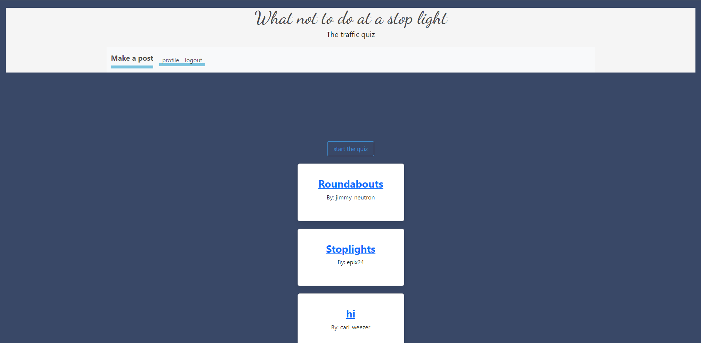

# WHAT NOT TO DO AT A STOPLIGHT

LIVE: https://trafficquiz.herokuapp.com/

GitHub: https://github.com/krezket/what-not-to-do-at-a-stoplight.git

## Table of Contents
* [Description](#description)
* [Installation](#installation)
* [Usage](#usage)
* [License](#license)
* [Contributors](#contributors)
* [Tests](#tests)
* [Questions](#questions)

## Description
What Not To Do At A Stoplight is an educational application to make driving safer.

The app features a blog section where guests can read comments related to safe driving at intersections. The blog is viewable to all guests without signing in.  Upon signing in, guests become users with the ability to create, edit or delete their posts.  Everyone has  the option to enter the quiz portion of the app. The quiz presents an illustrated traffic scenario, question and multiple choice answers.  Users have a set time limit to answer each question, and the scoring system is based on how many questions they answer correctly within the allotted time.  Upon entering an answer the app will pause the timer and show the correct answer.  Questions are based on the WA State Department of Transportation Drivers Handbook 2023.
    
## Screenshot
Image: 
    
## Installation
To install the dependencies require for the app to function, type: `npm i` in your integrated terminal.

Next right click on the `schema.sql`, open in integrated terminal, the log in to your mySQL.

Once you're logged in type: `SOURCE schema.sql` create the database.

Next right click on the `index.html` file in the seeds folder and type: `npm run seed` to seed the database with quiz questions.

Once the database has been seeded, go back to your main terminal and type: `node index.html`and hit enter.

The application should be running on localhost:3001.

## Usage
Feel free to reach out for any contributions you may want to add. 

## License
MIT

## Contributions
- Anthony Gurrero 
- Birhanu Mengistu 
- Jason Johnson 
- Gabriel Anderson 

## Tests
The following links should take you to the API for testing to see if the application stores the data:

`localhost:3001/api/topics`

`localhost:3001/api/comments`

`localhost:3001/api/users`

## Questions
## [krezket](https://github.com/krezket) 
## [linotmike](https://github.com/linotmike)
## [palmtopj](https://github.com/palmtopj)
## [ChickenChamp71](https://github.com/ChickenChamp71)